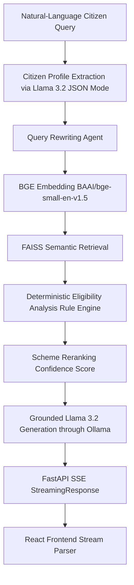

# GovAssist AI – An Intelligent Retrieval-Augmented Framework for Personalized Government Scheme Recommendation

## 1. Project Overview
GovAssist AI is an intelligent multi-agent framework designed to recommend government schemes to citizens using Retrieval-Augmented Generation (RAG). It combines semantic search, deterministic eligibility rule engines, and LLM-grounded explanations to ensure accuracy and prevent hallucination.

## 2. Architecture


## 3. Features
- **Conversational Profile Updating**: Extracts and merges demographics iteratively via Llama 3.2 JSON extraction.
- **RAG Semantic Search**: Fast top-K vector matching using FAISS `IndexFlatIP`.
- **Deterministic Eligibility**: strict non-LLM rule evaluation based on income, age, gender, occupation, etc.
- **SSE Streaming**: Real-time generation streaming from the backend to the React frontend.
- **Multilingual UI**: Interactive user interface built with React and Tailwind CSS.
- **Hallucination Prevention**: Strictly grounded explanations that link directly to official URLs and document requirements.

## 4. Technology Stack
- **Backend**: FastAPI, Python 3, LangGraph
- **Frontend**: React, Vite, Tailwind CSS, Lucide-React
- **Vector Database**: FAISS
- **Embeddings**: SentenceTransformers (`BAAI/bge-small-en-v1.5`)
- **LLM Engine**: Ollama (`llama3.2`)

## 5. Folder Structure
```
govassist/
├── backend/
│   ├── app/
│   │   ├── agents/          # LangGraph agents (memory, profile, etc.)
│   │   ├── rag/             # Vector store and embedding pipeline
│   │   ├── config.py        # Configuration
│   │   └── security.py      # Input validation
│   ├── data/                # Vector DB index and JSON meta
│   └── main.py              # FastAPI server
├── frontend/
│   ├── src/                 # React source (Pages, Components)
│   ├── package.json         # Node dependencies
│   └── vite.config.js       # Vite build config
├── data/                    # Raw CSV datasets
├── scripts/                 # Dataset processing/merging tools
├── tests/                   # Pytest test suite
└── README.md                # Documentation
```

## 6. Dataset Setup
The project relies on two primary datasets:
- `Schemes.csv` (3,400 records, 3,397 unique)
- `indian_government_schemes.csv` (4,693 unique schemes)
These files should be placed in the root `data/` folder.

## 7. Knowledge-base Generation
Run the merge script to clean, deduplicate, and combine the sources:
```bash
python scripts/merge_datasets.py
```
This produces `Merged_Schemes.csv` and achieves a final unique knowledge base of **4,858 unique schemes**.

## 8. FAISS Index Generation/Loading
On backend startup, `backend/app/rag/vector_store.py` will attempt to load the `.bin` FAISS index from `backend/data/`. If missing, it will dynamically calculate embeddings for all 4,858 schemes and save them to disk for fast future reloads.

## 9. BGE Model Setup
The backend automatically downloads the `BAAI/bge-small-en-v1.5` Hugging Face model on first execution. Ensure internet connectivity on initial run. The vector embedding dimension is **384**.

## 10. Ollama Installation
Install Ollama from [ollama.com](https://ollama.com). Ensure the Ollama service is running in the background (usually accessible at `http://localhost:11434`).

## 11. Llama 3.2 Setup
Once Ollama is installed, pull the specific model:
```bash
ollama pull llama3.2
```

## 12. Environment Variables
Create a `.env` file in the root if custom configurations are needed (or copy from `.env.example`).
Variables include:
- `OLLAMA_BASE_URL` (default: http://localhost:11434)
- `FAISS_INDEX_PATH` (default: backend/data/faiss_index)

## 13. Backend Setup
```bash
python -m pip install -r backend/requirements.txt
# Run the FastAPI server
cd backend
python main.py
```

## 14. Frontend Setup
```bash
cd frontend
npm install
npm run dev
```

## 15. How to Run
1. Start the Ollama local service.
2. Launch the backend FastAPI server on `localhost:8000`.
3. Launch the React frontend on `localhost:5173`.
4. Open the browser and begin the conversation!

## 16. Testing
Execute the complete unit and integration test suite:
```bash
python -m pytest tests/
```
Current Test Suite Baseline: **11/11 tests pass successfully** (0 failures, 0 errors). Tests cover Profile Extraction, Eligibility, SSE Streams, and endpoints.

## 17. Troubleshooting
- **FAISS Load Error**: If `faiss.swigfaiss_avx2` errors appear, this is normal on non-AVX2 CPUs. FAISS gracefully falls back to the standard binary.
- **Startup Timeout**: If the backend takes 10+ minutes to boot, it is building the FAISS index for the first time. Let it finish; subsequent starts take ~1 second via `.bin` persistence.
- **LLM Unresponsive**: Ensure `ollama run llama3.2` functions independently in the terminal.

## 18. Known Limitations
- The eligibility rules are strictly deterministic and operate on pre-defined dataset structures. Misspelled queries unhandled by query rewriting might fail eligibility gating.
- High memory usage (~2GB) may occur locally when Ollama loads the `llama3.2` weights into VRAM/RAM alongside the sentence transformer.

## Performance Benchmarks
*Deterministic Pipeline:*
- Profile extraction: 0.29 ms (Regex fallback)
- Query rewriting: 0.01 ms
- Embedding: 56.12 ms
- FAISS retrieval: 1.04 ms
- Eligibility: 0.52 ms
- Reranking: 2.45 ms
- **Combined deterministic pipeline:** ≈ 60.43 ms
*(Note: LLM generation streams independently and varies by local GPU hardware).*
